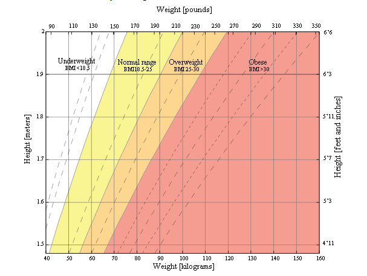

# Basic_health_BMIcalculator
Calculate Your Body Mass Index and create an environment which propmts for user input 

Body mass index (BMI)- is a measure of body fat based on height and weight that applies to adult men and women.

*Underweight = <18.5
*Normal weight = 18.5–24.9
*Overweight = 25–29.9
*Obesity = BMI of 30 or greater

## Risks associated with being overweight
Being overweight increases the risk of a number of serious diseases and health conditions. Below is a list of said risks, according to the Centers for Disease Control and Prevention (CDC):

1.High blood pressure
2.Higher levels of LDL cholesterol, which is widely considered "bad cholesterol," lower levels of HDL cholesterol, considered to be good cholesterol in moderation, and high levels of triglycerides
3.Type II diabetes
4.Coronary heart disease
5.Stroke
6.Gallbladder disease
7.Osteoarthritis, a type of joint disease caused by breakdown of joint cartilage
8.Sleep apnea and breathing problems
9.Certain cancers (endometrial, breast, colon, kidney, gallbladder, liver)
10.Low quality of life
11.Mental illnesses such as clinical depression, anxiety, and others
12.Body pains and difficulty with certain physical functions
13.Generally, an increased risk of mortality compared to those with a healthy BMI
As can be seen from the list above, there are numerous negative, in some cases fatal, outcomes that may result from being overweight. Generally, a person should try to maintain a BMI below 25 kg/m2, but ideally should consult their doctor to determine whether or not they need to make any changes to their lifestyle in order to be healthier.

## Risks associated with being underweight
Being underweight has its own associated risks, listed below:

*Malnutrition, vitamin deficiencies, anemia (lowered ability to carry blood vessels)
*Osteoporosis, a disease that causes bone weakness, increasing the risk of breaking a bone
*A decrease in immune function
*Growth and development issues, particularly in children and teenagers
*Possible reproductive issues for women due to hormonal imbalances that can disrupt the menstrual cycle. Underweight women also have a higher chance of miscarriage in the first trimester
*Potential complications as a result of surgery
*Generally, an increased risk of mortality compared to those with a healthy BMI
In some cases, being underweight can be a sign of some underlying condition or disease such as anorexia nervosa, which has its own risks. Consult your doctor if you think you or someone you know is underweight, particularly if the reason for being underweight does not seem obvious.

### Limitations of BMI
Although BMI is a widely used and useful indicator of healthy body weight, it does have its limitations. BMI is only an estimate that cannot take body composition into account. Due to a wide variety of body types as well as distribution of muscle, bone mass, and fat, BMI should be considered along with other measurements rather than being used as the sole method for determining a person's healthy body weight.
